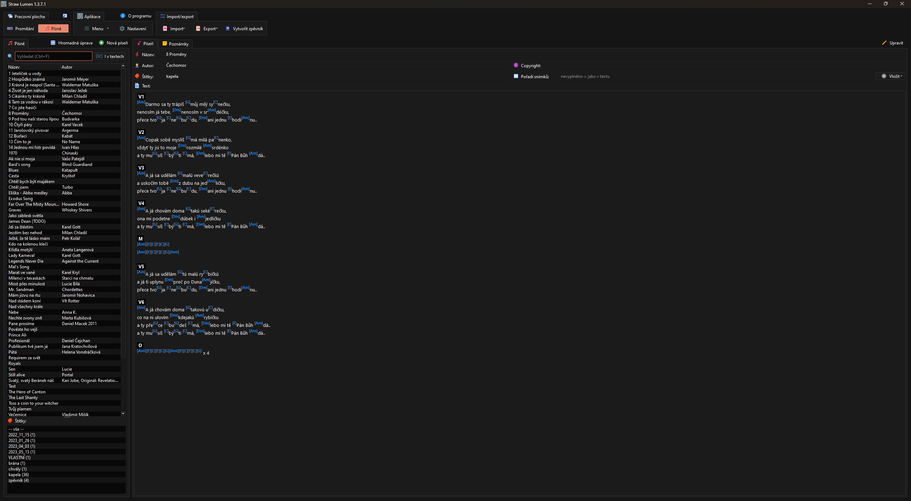
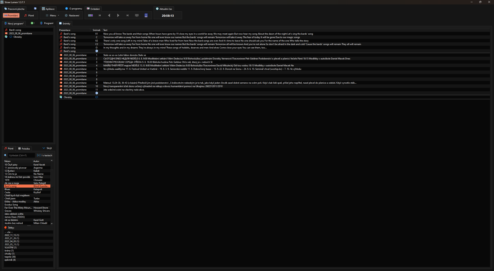

# Starw Lumen
Straw Lumen je freeware česká alternative pro OpenSong s několika dalšími funkcemi.

**Promítání písní.** Straw Lumen umožňuje promítání slov písní na druhém monitoru. Lze nastavit obrázek pozadí, barvu a písmo textů, ohraničení apod.

**PowerPoint prezentace.** Kromě písní z databáze lze z programu promítat i libovolné prezentace PowerPoint (aplikace PowerPoint musí být na počítači nainstalována). Snímky lze přepínat manuálně, prezentace se dá ale i přepnout do automatického módu, kdy se využívá časování přechodů snímků z prezentace.

**Biblické verše.** Aplikace obsahuje databázi Biblí v několika různých překladech a další lze stáhnout z internetu. Verše lze promítat stejným způsobem jako písně, powerpointové prezentace atp.

**Obrázky a videa.** Lumen má integrovaný přehrávač videí. Dále lze také promítat obrázky, a to manuálně nebo s nastavitelným intervalem procházení.

**Webové stránky.** Na promítanou obrazovku můžete také načíst webovou stránku. V programu je zabudovaný plnohodnotný webový prohlížeč s Javascriptem, takže stránka je plně interaktivní. Pokud umíte psát v HTML/JS, můžete promítat naprosto cokoli.

**OpenSong import/export.** Aplikace umí importovat i exportovat z/do formátu OpenSong.

**Editor písni.** Lumen obsahuje jednoduchý, ale nápomocný editor písní s akordy. Akordy se oproti formátu OpenSong nezapisují na samostatný řádek, ale vkládají se přímo do textu na to místo, kde má být akord zahrán. Název akordu se zapisuje mezi [hranaté závorky] (Ctrl+Alt+F, Ctrl+Alt+G).

**Transpozice akordů.** V editoru písní lze jedním kliknutím transponovat akordy.

**Kopírování akordů mezi slokami.** Editor umí vzít akordy z jedné sloky a zkopírovat je na správná místa v jiné sloce. Pozici akordů určuje podle počtu slabik před akordem od začátku řádku. Případné korekce, kdy verše obsahují rozdílné počty slabik, lze provést jednoduše díky funkci, která umožňuje posouvat akordy v textu po slabikách.

**Vytváření zpěvníků.** Aplikace umožňuje vytvoření zpěvníku ve formátu **PDF** (vhodné pro tisk) a **HTML** (vhodné pro zobrazování na mobilu atp.) ze zvolených písní. Formu zpěvníku lze v mnohém přizpůsobit, aby se dal uplatnit v různých situacích.

## Stáhnout
* [**Windows 64-bit**](https://api2.danol.cz/?action=downloadSoftware&product=lumen&platform=win_x86_64)
* [**Windows 32-bit**](https://api2.danol.cz/?action=downloadSoftware&product=lumen&platform=win_x86)

#### Dodatečné materiály
* [**Kancionálové písně CB**](kancionalCB.strawLumen)

## Odkazy
* [Demo video](https://www.youtube.com/embed/QR0BEUmtWZk?origin=http://straw-solutions.cz)
* [Facebook stránka](https://www.facebook.com/Straw-Lumen-2006377716122441)
* [Facebook komunita](https://www.facebook.com/groups/1944200419221897)

## Média

